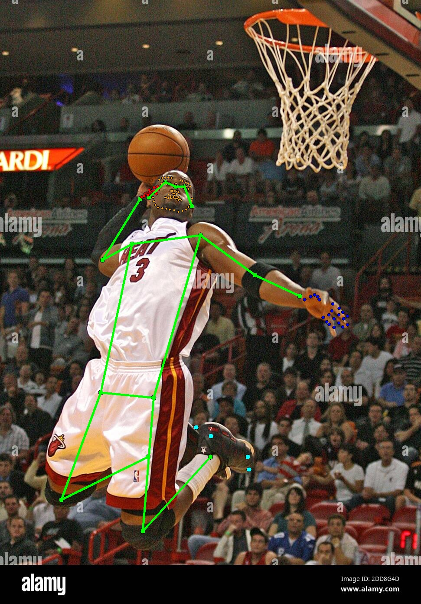
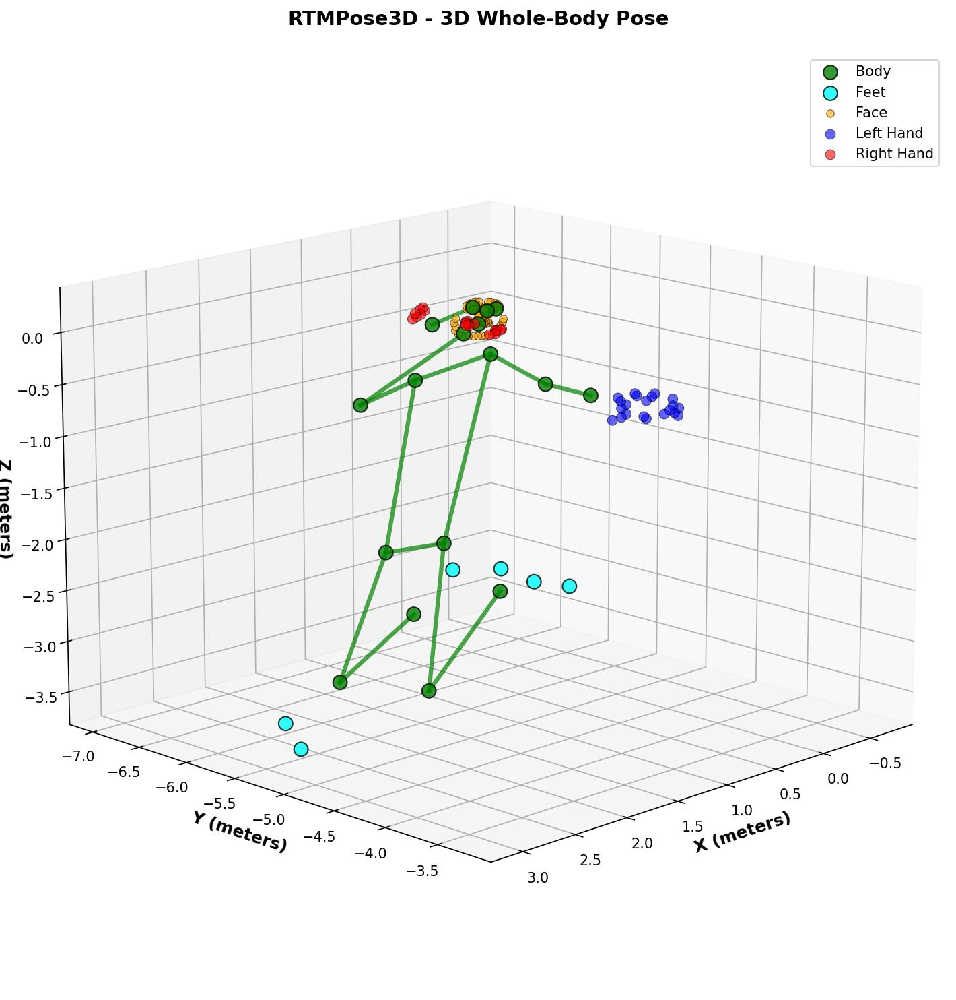

# RTMPose3D

Standalone PyTorch package for real-time whole-body 3D pose estimation. Provides both simple inference API and HuggingFace Transformers-style interface with automatic checkpoint download and caching.

## Visual Examples

<div align="center">
  
  
  
  <p><i>Left: 2D keypoint detection with skeleton overlay. Right: Reconstructed 3D skeleton with color-coded body parts.</i></p>
</div>

## Features

- 133 keypoints: body (17) + feet (6) + face (68) + hands (42)
- Both 2D and 3D outputs with confidence scores
- HuggingFace Hub integration with auto-download
- Single-person detection mode
- Batch processing support

## Requirements

- Python 3.11, PyTorch 2.4.0, CUDA 12.1 drivers
- CUDA-capable GPU (recommended, 4GB+ VRAM)

## Installation

```bash
# Clone repository
git clone https://github.com/mutedeparture/rtmpose3d.git

# Will ensure that the dependencies are installed correctly
uv run main.py
```

Model checkpoints (~330MB) auto-download from [HuggingFace Hub](https://huggingface.co/rbarac/rtmpose3d) on first use and cache to `~/.cache/rtmpose3d/checkpoints/`.

## Quick Start

### HuggingFace Transformers-Style API (Recommended)

```python
import cv2
from rtmpose3d import RTMPose3D

# Initialize model (auto-downloads checkpoints)
model = RTMPose3D.from_pretrained('rbarac/rtmpose3d', device='cuda:0')

# Run inference
image = cv2.imread('person.jpg')
results = model(image, return_tensors='np')

# Access results
keypoints_3d = results['keypoints_3d']  # [N, 133, 3] - 3D coords in meters
keypoints_2d = results['keypoints_2d']  # [N, 133, 2] - pixel coords
scores = results['scores']              # [N, 133] - confidence [0, 1]
```

### Simple Inference API

```python
from rtmpose3d import RTMPose3DInference

model = RTMPose3DInference(device='cuda:0')
results = model(image)
print(results['keypoints_3d'].shape)  # [N, 133, 3]
```

### Single Person Detection

Detect only the most prominent person (largest bbox × highest confidence):

```python
# Works with both APIs
results = model(image, single_person=True)  # Returns N=1
```

## Output Format

```python
{
    'keypoints_3d': np.ndarray,  # [N, 133, 3] - (X, Y, Z) in meters
    'keypoints_2d': np.ndarray,  # [N, 133, 2] - (x, y) pixel coords
    'scores': np.ndarray,        # [N, 133] - confidence [0, 1]
    'bboxes': np.ndarray         # [N, 4] - [x1, y1, x2, y2]
}
```

**N** = number of detected persons

### Coordinate Systems

**2D Keypoints**: Pixel coordinates

- X: horizontal [0, image_width]
- Y: vertical [0, image_height]

**3D Keypoints**: Camera-relative in meters (Z-up convention)

- X: horizontal (negative=left, positive=right)
- Y: depth (negative=closer, positive=farther)
- Z: vertical (negative=down, positive=up)

## Keypoint Format

133 keypoints in COCO-WholeBody format:

| Index   | Body Part  | Count | Description                                                      |
| ------- | ---------- | ----- | ---------------------------------------------------------------- |
| 0-16    | Body       | 17    | Nose, eyes, ears, shoulders, elbows, wrists, hips, knees, ankles |
| 17-22   | Feet       | 6     | Foot keypoints                                                   |
| 23-90   | Face       | 68    | Facial landmarks                                                 |
| 91-111  | Left Hand  | 21    | Left hand keypoints                                              |
| 112-132 | Right Hand | 21    | Right hand keypoints                                             |

## Advanced Usage

### Return PyTorch Tensors

```python
results = model(image, return_tensors='pt')
keypoints_3d = results['keypoints_3d']  # torch.Tensor on device
```

### Model Size Selection

```python
# Large model (default, best balance)
model = RTMPose3DInference(model_size='l')

# Extra large model (higher accuracy, slower)
model = RTMPose3DInference(model_size='x')
```

### Detection Threshold

```python
results = model(image, bbox_thr=0.5)  # Higher = fewer, more confident detections
```

### Custom Cache Directory

```python
model = RTMPose3DInference(cache_dir='/path/to/cache')
```

### Save/Load Configuration

```python
# Save
model.save_pretrained('./my_model')

# Load from local directory
model = RTMPose3D.from_pretrained('./my_model', device='cuda:0')
```

### Clear Cache

```python
from rtmpose3d import clear_cache
clear_cache()  # Removes all cached checkpoints
```

## Model Information

**RTMW3D-L (Large)** - Default

- 65M parameters
- Input: RGB image (auto-resized to 384×288)
- Output: 133 3D keypoints per person
- Speed: Real-time on modern GPUs

**RTMW3D-X (Extra Large)**

- 98M parameters
- Higher accuracy, slower inference

**Checkpoints** (~330MB total):

- Person Detector (RTMDet-M): ~99MB
- Pose Estimator (RTMW3D-L): ~231MB
- Source: [rbarac/rtmpose3d](https://huggingface.co/rbarac/rtmpose3d) on HuggingFace Hub
- Cache: `~/.cache/rtmpose3d/checkpoints/`

## Technical Notes

- **2D Keypoints**: Extracted from MMPose's `transformed_keypoints` for accurate pixel coordinates in original image space
- **3D Coordinates**: Transformed via `-kpts[..., [0, 2, 1]]` to achieve Z-up convention (swap Y/Z axes, negate all)
- **Height Measurement**: Typical nose-to-ankle range is 1.5-3.0 meters depending on camera perspective and distance. Relative positions are more reliable than absolute measurements.

## Examples

```bash
uv run examples/basic_usage.py [image_path]
uv run tests/test_visualize.py [image_path] [output_name]
```

## Citation

```bibtex
@misc{rtmpose3d2025,
  title={RTMPose3D: Real-Time Multi-Person 3D Pose Estimation},
  author={Arac, Bahadir},
  year={2025},
  publisher={GitHub},
  url={https://github.com/mutedeparture/rtmpose3d}
}
```

## License

Apache 2.0

## Acknowledgments

Built on [MMPose](https://github.com/open-mmlab/mmpose) by OpenMMLab.
